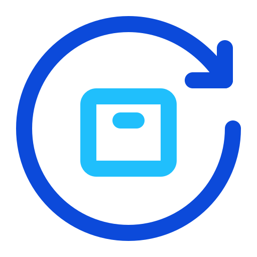

# Rebox UI - React Component Library

<div align="center">
  
  <h3>React components styled with plain CSS — not utility-locked</h3>
  <p>Copy and paste ready React UI components styled with plain CSS. No dependencies, no setup — just copy and use.</p>
</div>

## ✨ Features

- **🚀 No Dependencies** - Zero external dependencies required
- **🎨 Plain CSS Styling** - Styled with readable CSS, not utility classes
- **📋 Copy & Paste Ready** - Just copy the code and use in your project
- **⚡ Fast & Lightweight** - Minimal footprint, maximum performance
- **🔧 Fully Customizable** - Easy to modify and extend
- **📱 Responsive Design** - Works on all screen sizes

## 🚀 Quick Start

1. **Browse Components** - Visit the Rebox web interface
2. **Copy Code** - Select and copy the component code
3. **Paste & Customize** - Add to your project and style as needed
4. **No Installation** - No npm packages or build tools required

## 📦 Available Components

| Component | Variants | Description |
|-----------|----------|--------------|
| **Button** | 5 variants | Primary, Secondary, Outline, Link, Danger buttons |
| **Badge** | 2 variants | Small labels for status and categories |
| **Card** | 3 variants | Flexible containers for grouping content |
| **Tooltip** | 1 variant | Hover information pop-ups |

## 💻 Tech Stack

- **React 19** - Latest React with modern features
- **TypeScript** - Type-safe development
- **Vite** - Fast build tool and dev server
- **Tailwind CSS** - Utility-first CSS framework
- **React Router** - Client-side routing
- **React Icons** - Beautiful icon library

## 🎨 Styling Philosophy

Rebox components use **plain CSS** instead of utility classes, making them:

- **Readable** - Clear, semantic class names
- **Maintainable** - Easy to understand and modify
- **Flexible** - Not locked into any CSS framework
- **Customizable** - Simple to override and extend

### Example Button Component

```tsx
// React Component
<button className="btn btn-primary">Primary Button</button>
```

```css
/* Plain CSS Styling */
.btn {
  padding: 0.75rem 1.5rem;
  border-radius: 0.375rem;
  transition: all 0.2s ease-in-out;
  font-weight: bold;
}

.btn-primary {
  background-color: #3b82f6;
  color: white;
}

.btn-primary:hover {
  background-color: #2563eb;
}
```

## 🛠️ Development

```bash
# Clone the repository
git clone <repository-url>

# Navigate to project
cd rebox

# Install dependencies
bun install

# Start development server
bun run dev

# Build for production
bun run build
```

## 📁 Project Structure

```
src/
├── components/          # Reusable UI components
│   ├── codeTabs.tsx    # Code display component
│   ├── navbar.tsx      # Navigation component
│   └── footer.tsx      # Footer component
├── views/              # Page components
│   └── content/        # Component showcase pages
├── model/              # Component data and configurations
├── interface/          # TypeScript interfaces
├── style/              # CSS stylesheets
└── assets/             # Static assets
```

## 🤝 Contributing

Contributions are welcome! Please feel free to submit a Pull Request.

## 📄 License

Apache License 2.0

---

<div align="center">
  <p>Made with ❤️ for the React community</p>
  <p>Simple. Customizable. Readable.</p>
</div>
